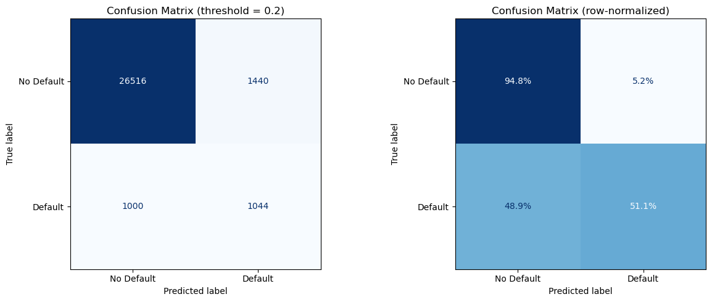
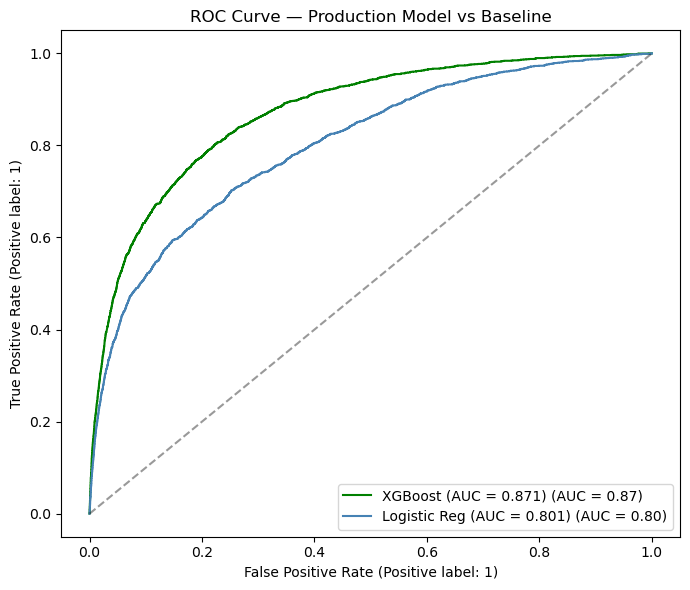
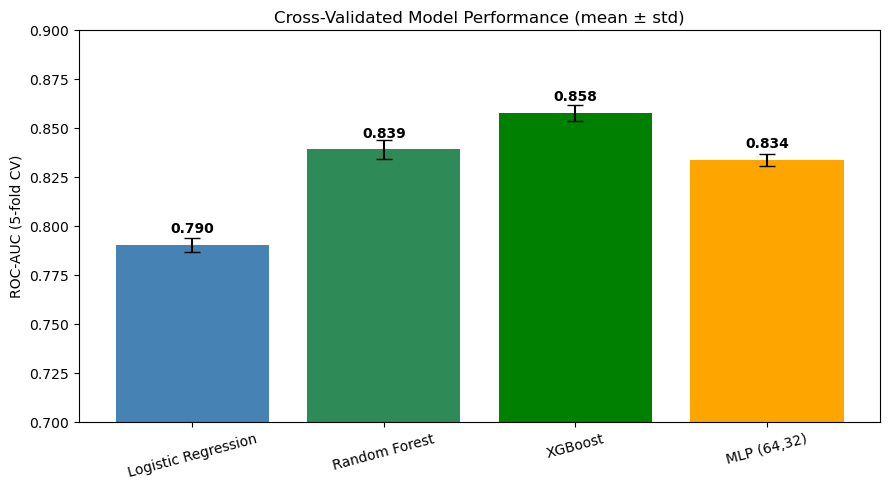

# 🏦 Credit Default Risk Predictor

An end-to-end, **explainable**, and **stress-tested** machine-learning system that predicts retail
loan default on the [Give Me Some Credit](https://www.kaggle.com/c/GiveMeSomeCredit) dataset
(150,000 borrowers). Built to demonstrate the full modelling lifecycle a bank credit-risk team
actually runs — from EDA to a governed, deployable scoring app.


---

## Why this project stands out
- **11-stage pipeline:** EDA → segmentation → regularized baseline → model bake-off (incl. a neural
  network) → cross-validation & tuning → evaluation visuals → SHAP → LIME → stress testing → productionization.
- **Rigorous validation:** 5-fold stratified cross-validation with mean ± std, not a single lucky split.
- **Fully explainable:** SHAP waterfalls and LIME explanations for every decision — audit-ready.
- **Stress-tested:** the portfolio is re-scored under three macroeconomic scenarios (CCAR-style).
- **Deployable:** a Streamlit app loads serialized artifacts and returns an instant, explained score.
- **Governed:** a complete [model card](MODEL_CARD.md) documents intended use, fairness, and limitations.

---

## Results

<p align="center">
  
  
</p>

**Hold-out test ROC-AUC**

| Model | Test ROC-AUC |
|---|---|
| Decision Tree (deep) | 0.613 |
| Decision Tree (shallow) | 0.818 |
| Logistic Regression (L1/L2) | 0.801 |
| Random Forest | 0.844 |
| MLP neural network (64, 32) | 0.844 |
| XGBoost (default) | 0.864 |
| **XGBoost (tuned)** | **0.871** |

**5-fold cross-validation (mean ± std AUC):** Logistic 0.790 ± 0.004 · MLP 0.834 ± 0.003 ·
Random Forest 0.839 ± 0.005 · **XGBoost 0.858 ± 0.004**.



**Final model:** tuned XGBoost at threshold **0.20** (recall ≈ 51%), optimized for the lending cost
asymmetry — a missed default costs far more than a false alarm.

---

## Explainability (SHAP + LIME)
Banking regulation (SR 11-7, ECOA / Reg B) requires lenders to explain credit decisions. This project
provides two independent methods:
- **SHAP** — global beeswarm/bar importance plus per-borrower waterfall plots whose contributions
  provably sum to the prediction.
- **LIME** — a local linear surrogate as a second opinion on the same borrower.

Both agree with the logistic-regression coefficients: **past delinquency** and **revolving
utilization** dominate default risk.

---

## Macroeconomic Stress Testing
The test portfolio is re-scored under adverse scenarios (income falls, utilization/debt rise,
delinquencies climb). Expected loss assumes 65% LGD on a $10,000 exposure.

| Scenario | Mean PD | Approval @0.20 | Expected loss / loan |
|---|---|---|---|
| Baseline | 6.6% | 91.7% | $431 |
| Mild Recession | 8.1% | 89.1% | $525 |
| Severe Recession | 44.4% | 0.4% | $2,889 |

---

## Live Scoring Dashboard
`app.py` is a Streamlit app that loads the serialized model and, for any borrower, returns:
1. a **default probability** and approve / review / decline recommendation,
2. a **SHAP waterfall** explaining the score, and
3. the **top 3 risk factors** driving the decision.

```bash
streamlit run app.py
```
The app loads artifacts from `models/` and never retrains on a click.

---

## Project Structure
```
credit-default-risk/
├── data/                         # cs-training.csv (download from Kaggle; git-ignored)
├── models/                       # serialized artifacts: scaler, kmeans, xgb_model, metadata
├── notebooks/
│   └── Credit Default Risk Analysis.ipynb   # full 11-phase analysis with embedded outputs
├── app.py                        # Streamlit scoring + SHAP explanation dashboard
├── executive_summary.png         # stakeholder summary chart
├── MODEL_CARD.md                 # model governance documentation
├── requirements.txt
└── README.md
```

---

## Methodology

**Phase 1 — EDA & Statistics.** Explored 150k borrowers; median-imputed missing income/dependents;
t-tests confirmed age, delinquency, and income differ significantly between defaulters and non-defaulters.

**Phase 2 — Unsupervised Segmentation.** K-Means (k=4 via elbow) found a high-risk cluster; the
segment label became an engineered feature.

**Phase 3 — Regularized Baseline.** Logistic Regression with L1/L2 (AUC ≈ 0.80); coefficients confirm
past delinquency as the dominant signal.

**Phase 4 — Model Progression & Bias-Variance.** Decision trees → Random Forest → **MLP neural
network** → XGBoost, visualizing overfitting and how ensembling/boosting fixes it.

**Phase 5 — Evaluation & Threshold Tuning.** ROC-AUC, precision/recall, and a business-driven 0.20
threshold instead of the naive 0.50.

**Phase 6 — Cross-Validation & Tuning.** 5-fold stratified CV for robust mean ± std AUC, then
`GridSearchCV` to tune XGBoost (best: `lr=0.1, depth=3, 200 trees`).

**Phase 7 — Evaluation Visuals.** Confusion matrix (raw + normalized), ROC curve vs baseline, and
gain + permutation feature importance.

**Phase 8 — SHAP.** Global and local explanations via `TreeExplainer`.

**Phase 9 — LIME.** Model-agnostic local explanations and a SHAP-vs-LIME comparison.

**Phase 10 — Stress Testing.** Three macro scenarios with predicted default rate, approval rate, and
expected loss.

**Phase 11 — Productionization.** Serialize artifacts with `joblib` for the Streamlit app; verify the
reloaded model reproduces the test AUC exactly.

---

## Setup

```bash
# Clone
git clone https://github.com/paularezzonico1/credit-default-risk.git
cd credit-default-risk

# Install pinned dependencies
pip install -r requirements.txt

# Download data from Kaggle and place cs-training.csv in data/
# https://www.kaggle.com/c/GiveMeSomeCredit/data

# Reproduce the full analysis (regenerates models/ artifacts)
jupyter nbconvert --to notebook --execute --inplace "notebooks/Credit Default Risk Analysis.ipynb"

# Launch the scoring dashboard
streamlit run app.py
```

---

## Key Talking Points
1. **Leakage prevention** — a time-ordered split mirrors deployment; a random split would leak future
   loans into training and inflate performance.
2. **Why not accuracy?** — on a 93/7 target, "always predict no default" is 93% accurate and useless;
   AUC, recall, and threshold tuning are the right tools.
3. **Threshold as a business decision** — 0.20 reflects the asymmetric cost of a missed default vs a
   false alarm, not a statistical default.
4. **Explainability is non-negotiable in lending** — SHAP/LIME give an auditable reason for every
   decision, satisfying ECOA adverse-action and SR 11-7 expectations.
5. **Stress testing** — the model degrades sharply but sensibly under a severe recession, exactly the
   early-warning signal a risk committee needs.

---

## Tech Stack
`Python` · `pandas` · `NumPy` · `scikit-learn` · `XGBoost` · `SHAP` · `LIME` · `matplotlib` ·
`seaborn` · `SciPy` · `Streamlit` · `Jupyter`

## License
MIT — see [LICENSE](LICENSE). Educational/demonstration project; see [MODEL_CARD.md](MODEL_CARD.md)
for intended use and limitations.

---
*Author: Paula Rezzonico*
